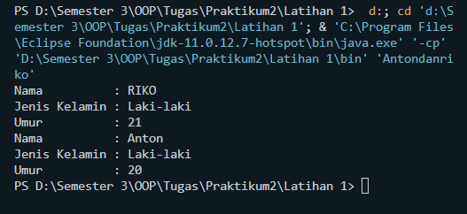

# **Praktikum 2**
```sh
Nama    : Achmad Mahfud
NIM     : 312110520
Kelas   : TI.21.C5
```
## Setter dan Getter
### Setter

- Setter digunakan untuk memberikan nilai pada variable yang
diperoleh dari class utama.
- Method setter bersifat void atau tanpa memberikannilai kembalian.
### Getter

- Method getter untuk mengambil nilai dari masing-masing variabel.
- Hal ini bertujuan untuk mengambil nilai dari variabel pada class.
- Perlu diketahui pula, bahwa pembuatan variabel pada parameter di method getter, harus sesuai dengan tipe data pada variabel yang
dideklarasikan di kelas.

## *Program :* 
```sh
public class Person {
    private String nama;
    private String jenisKelamin;
    private int umur;

    // setter
    public void setNama(String nama) {
        this.nama = nama;
    }
    public void setJenisKelamin(String jenisKelamin){
        this.jenisKelamin = jenisKelamin;
    }
    public void setUmur(int umur) {
        this.umur = umur;
    }

    // getter
    public String getNama() {
        return this.nama;
    }
    public String getJenisKelamin() {
        return this.jenisKelamin;
    }
    public int getUmur() {
        return this.umur;
    }

}
```
```sh
public class Antondanriko {
    public static void main(String[] args){
        // Object Riko
        Person Riko = new Person();
        
        Riko.setNama("RIKO");
        Riko.setJenisKelamin("Laki-laki");
        Riko.setUmur(21);
        System.out.println("Nama          : " + Riko.getNama());
        System.out.println("Jenis Kelamin : " + Riko.getJenisKelamin());
        System.out.println("Umur          : " + Riko.getUmur());
        

        // Object Anton
        Person Anton = new Person();

        Anton.setNama("Anton");
        Anton.setJenisKelamin("Laki-laki");
        Anton.setUmur(20);
        System.out.println("Nama          : " + Anton.getNama());
        System.out.println("Jenis Kelamin : " + Anton.getJenisKelamin()); 
        System.out.println("Umur          : " + Anton.getUmur());
    }
}
```
## *Output Program :* 
